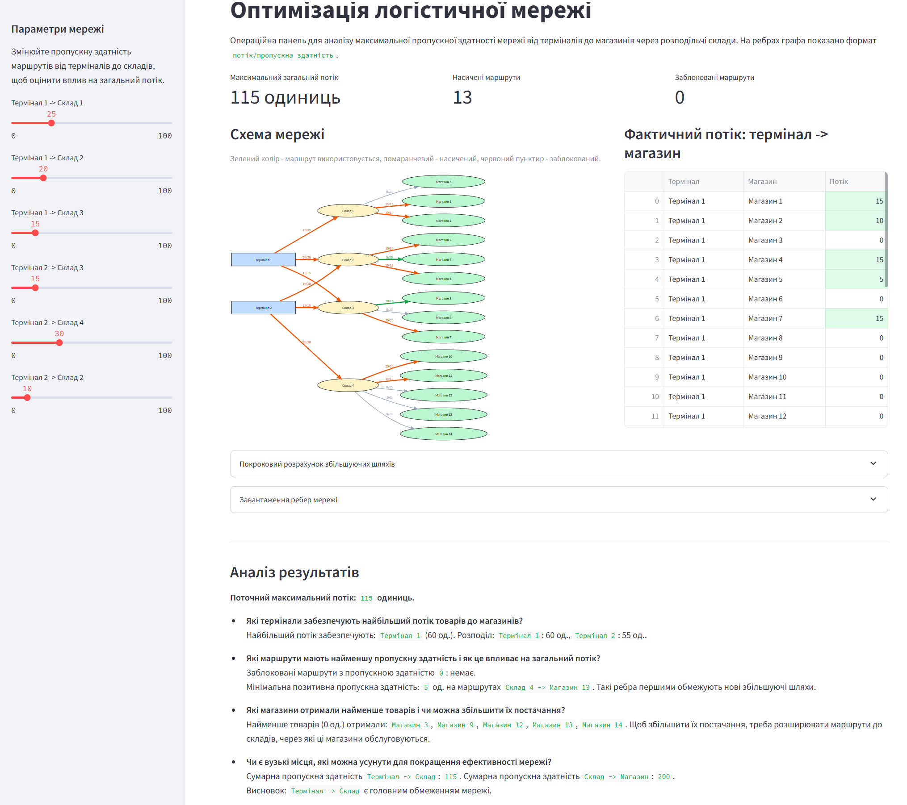

# Тема 3-4. Просунуті структури для оптимізації та пошуку

## Завдання 1. Максимальний потік

Реалізовано модель логістичної мережі з 20 основними вершинами: 2 термінали, 4 склади та 14 магазинів. Для стандартного запуску алгоритму Едмондса-Карпа додано допоміжні вершини `Source` і `Sink`, які не належать до початкової логістичної мережі.

Алгоритм обчислює максимальний потік від терміналів до магазинів через склади. Отриманий максимальний потік:

```text
115 одиниць
```

### Запуск

```bash
python goit-algo2-hw-04/task_1/task_1.py
```

Початкові умови графа винесені у файл `goit-algo2-hw-04/task_1/data/logistics_edges.csv`. За замовчуванням `task_1.py` використовує саме цей файл, який відповідає таблиці ребер із документа із завданням.

Структура задачі 1:

- `task_1/max_flow.py` - алгоритм Едмондса-Карпа, валідація CSV та розрахунок потоків;
- `task_1/config.py` - службові константи мережі;
- `task_1/data/logistics_edges.csv` - вхідні ребра та пропускні здатності;
- `task_1/task_1.py` - консольний запуск;
- `task_1/app.py` - інтерактивна Streamlit-панель.

CSV-файл перевіряється перед розрахунком: мають бути колонки `start`, `end`, `capacity`, відомі вершини та невід'ємні цілі пропускні здатності.

### Інтерактивний Streamlit-додаток

Для візуальної перевірки мережі додано `task_1/app.py`. Додаток дозволяє змінювати пропускні здатності маршрутів `Термінал -> Склад`, показує граф у форматі `потік/пропускна здатність`, таблицю потоків, збільшуючі шляхи та аналітику вузьких місць.

Залежності:

```bash
pip install -r goit-algo2-hw-04/requirements.txt
```

Запуск:

```bash
streamlit run goit-algo2-hw-04/task_1/app.py
```



### Вхідні ребра мережі

| Від | До | Пропускна здатність |
|---|---|---:|
| Термінал 1 | Склад 1 | 25 |
| Термінал 1 | Склад 2 | 20 |
| Термінал 1 | Склад 3 | 15 |
| Термінал 2 | Склад 3 | 15 |
| Термінал 2 | Склад 4 | 30 |
| Термінал 2 | Склад 2 | 10 |
| Склад 1 | Магазин 1 | 15 |
| Склад 1 | Магазин 2 | 10 |
| Склад 1 | Магазин 3 | 20 |
| Склад 2 | Магазин 4 | 15 |
| Склад 2 | Магазин 5 | 10 |
| Склад 2 | Магазин 6 | 25 |
| Склад 3 | Магазин 7 | 20 |
| Склад 3 | Магазин 8 | 15 |
| Склад 3 | Магазин 9 | 10 |
| Склад 4 | Магазин 10 | 20 |
| Склад 4 | Магазин 11 | 10 |
| Склад 4 | Магазин 12 | 15 |
| Склад 4 | Магазин 13 | 5 |
| Склад 4 | Магазин 14 | 10 |

### Покроковий розрахунок

Алгоритм Едмондса-Карпа на кожній ітерації шукає найкоротший збільшуючий шлях у залишковій мережі за допомогою BFS. Потік, який додається на кроці, дорівнює мінімальній залишковій пропускній здатності на знайденому шляху.

| Крок | Збільшуючий шлях | Доданий потік |
|---:|---|---:|
| 1 | Source -> Термінал 1 -> Склад 1 -> Магазин 1 -> Sink | 15 |
| 2 | Source -> Термінал 1 -> Склад 1 -> Магазин 2 -> Sink | 10 |
| 3 | Source -> Термінал 1 -> Склад 2 -> Магазин 4 -> Sink | 15 |
| 4 | Source -> Термінал 1 -> Склад 2 -> Магазин 5 -> Sink | 5 |
| 5 | Source -> Термінал 1 -> Склад 3 -> Магазин 7 -> Sink | 15 |
| 6 | Source -> Термінал 2 -> Склад 2 -> Магазин 5 -> Sink | 5 |
| 7 | Source -> Термінал 2 -> Склад 2 -> Магазин 6 -> Sink | 5 |
| 8 | Source -> Термінал 2 -> Склад 3 -> Магазин 7 -> Sink | 5 |
| 9 | Source -> Термінал 2 -> Склад 3 -> Магазин 8 -> Sink | 10 |
| 10 | Source -> Термінал 2 -> Склад 4 -> Магазин 10 -> Sink | 20 |
| 11 | Source -> Термінал 2 -> Склад 4 -> Магазин 11 -> Sink | 10 |

Сума доданих потоків: `15 + 10 + 15 + 5 + 15 + 5 + 5 + 5 + 10 + 20 + 10 = 115`.

### Підсумкова таблиця потоків

Таблиця показує фактичний обсяг товарів між терміналами та магазинами за детермінованою декомпозицією збільшуючих шляхів. Максимальний потік може мати кілька еквівалентних розподілів, але загальна величина потоку залишається `115`.

| Термінал | Магазин | Фактичний потік |
|---|---|---:|
| Термінал 1 | Магазин 1 | 15 |
| Термінал 1 | Магазин 2 | 10 |
| Термінал 1 | Магазин 3 | 0 |
| Термінал 1 | Магазин 4 | 15 |
| Термінал 1 | Магазин 5 | 5 |
| Термінал 1 | Магазин 6 | 0 |
| Термінал 1 | Магазин 7 | 15 |
| Термінал 1 | Магазин 8 | 0 |
| Термінал 1 | Магазин 9 | 0 |
| Термінал 1 | Магазин 10 | 0 |
| Термінал 1 | Магазин 11 | 0 |
| Термінал 1 | Магазин 12 | 0 |
| Термінал 1 | Магазин 13 | 0 |
| Термінал 1 | Магазин 14 | 0 |
| Термінал 2 | Магазин 1 | 0 |
| Термінал 2 | Магазин 2 | 0 |
| Термінал 2 | Магазин 3 | 0 |
| Термінал 2 | Магазин 4 | 0 |
| Термінал 2 | Магазин 5 | 5 |
| Термінал 2 | Магазин 6 | 5 |
| Термінал 2 | Магазин 7 | 5 |
| Термінал 2 | Магазин 8 | 10 |
| Термінал 2 | Магазин 9 | 0 |
| Термінал 2 | Магазин 10 | 20 |
| Термінал 2 | Магазин 11 | 10 |
| Термінал 2 | Магазин 12 | 0 |
| Термінал 2 | Магазин 13 | 0 |
| Термінал 2 | Магазин 14 | 0 |

### Аналіз результатів

**Які термінали забезпечують найбільший потік товарів до магазинів?**

Обидва термінали використали всі свої вихідні можливості: `Термінал 1` передав `60` одиниць, `Термінал 2` передав `55` одиниць. Найбільший внесок має `Термінал 1`, але різниця невелика.

**Які маршрути мають найменшу пропускну здатність і як це впливає на загальний потік?**

Найменша пропускна здатність серед основних ребер є на маршруті `Склад 4 -> Магазин 13`: `5` одиниць. Також низькі пропускні здатності мають ребра по `10` одиниць: `Термінал 2 -> Склад 2`, `Склад 1 -> Магазин 2`, `Склад 2 -> Магазин 5`, `Склад 3 -> Магазин 9`, `Склад 4 -> Магазин 11`, `Склад 4 -> Магазин 14`. Проте головне обмеження мережі утворюють входи до складів: сумарно термінали можуть передати на склади рівно `115` одиниць, тому після насичення цих ребер додатковий попит магазинів уже не може бути задоволений.

**Які магазини отримали найменше товарів і чи можна збільшити їх постачання?**

Найменше отримали магазини з нульовим потоком: `Магазин 3`, `Магазин 9`, `Магазин 12`, `Магазин 13`, `Магазин 14`, а також магазини, які не повністю використали потенційні входи, наприклад `Магазин 6` і `Магазин 8`. Збільшити постачання можна не лише розширенням ребер до цих магазинів, а насамперед збільшенням пропускної здатності на маршрутах від терміналів до відповідних складів: до `Склад 1`, `Склад 3` і `Склад 4`.

**Чи є вузькі місця, які можна усунути для покращення ефективності мережі?**

Так. Усі чотири склади отримують від терміналів стільки, скільки дозволяють вхідні ребра: `Склад 1` - `25`, `Склад 2` - `30`, `Склад 3` - `30`, `Склад 4` - `30`. Водночас вихідна місткість складів до магазинів більша за фактично використану для `Склад 1`, `Склад 2`, `Склад 3` і `Склад 4`. Тому найефективніше покращення - збільшити пропускну здатність ребер `Термінал -> Склад`, особливо до складів, які обслуговують магазини з нульовим або малим потоком.

## Завдання 2. Префіксні дерева

Реалізовано базовий клас `Trie` у файлі `task_2/trie.py` та клас `Homework(Trie)` у файлі `task_2/task_2.py`.

Додані методи:

- `count_words_with_suffix(pattern) -> int` - повертає кількість слів, що закінчуються на заданий суфікс;
- `has_prefix(prefix) -> bool` - перевіряє, чи існує хоча б одне слово із заданим префіксом.

Методи враховують регістр символів і піднімають `TypeError`, якщо параметр не є рядком.

### Особливості реалізації

- `Homework` успадковує базовий `Trie`;
- `has_prefix` проходить Trie символ за символом і працює за `O(k)`, де `k` - довжина префікса;
- `count_words_with_suffix` використовує індекс суфіксів, який оновлюється під час додавання та видалення слів;
- запит суфікса виконується за `O(1)` у середньому завдяки словнику `_suffix_counts`;
- додавання слова потребує `O(m)` для Trie та `O(m)` для індексації суфіксів, де `m` - довжина слова.

### Запуск

```bash
python goit-algo2-hw-04/task_2/task_2.py
```

Очікуваний результат:

```text
Етап 1. Додавання слів
----------------------
Перевіряємі слова: apple, application, banana, cat
Додано слово: apple, значення: 0
Додано слово: application, значення: 1
Додано слово: banana, значення: 2
Додано слово: cat, значення: 3

Етап 2. Перевірка суфіксів
--------------------------
Суфікс: 'e', результат: 1
Суфікс: 'ion', результат: 1
Суфікс: 'a', результат: 1
Суфікс: 'at', результат: 1
Суфікс: 'z', результат: 0
Суфікс: 'A', результат: 0

Етап 3. Перевірка префіксів
---------------------------
Префікс: 'app', результат: True
Префікс: 'bat', результат: False
Префікс: 'ban', результат: True
Префікс: 'ca', результат: True
Префікс: 'App', результат: False

Етап 4. Перевірка некоректних параметрів
----------------------------------------
Суфікс: None, результат: TypeError для некоректного параметра
Префікс: None, результат: TypeError для некоректного параметра
Суфікс: 42, результат: TypeError для некоректного параметра
Префікс: 42, результат: TypeError для некоректного параметра
Суфікс: ['app'], результат: TypeError для некоректного параметра
Префікс: ['app'], результат: TypeError для некоректного параметра
Усі тести пройдено успішно.
```
